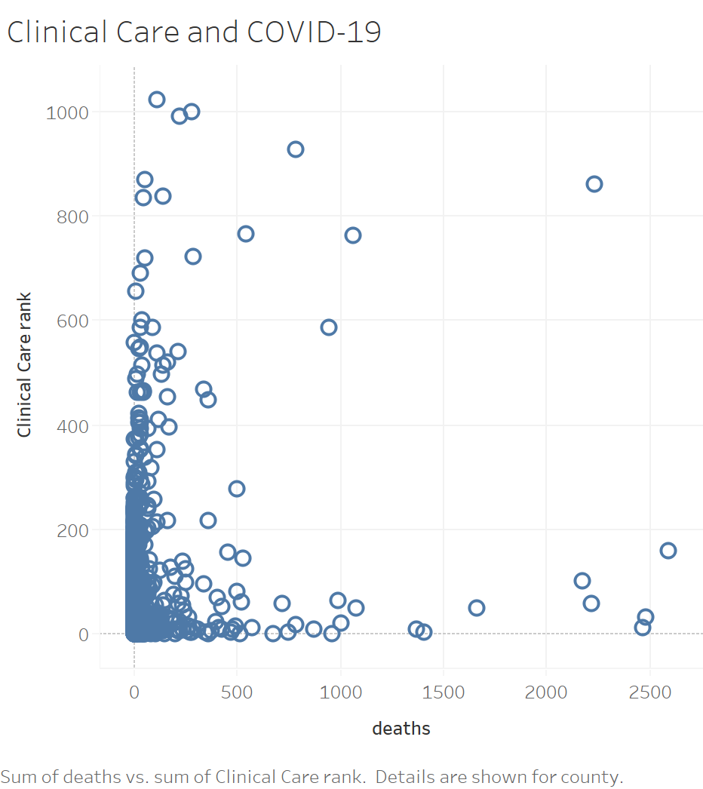

<h1 align=center>COVID-19 Mortality Risk Factors and economic policies</h1>

<h2 align=center>Hackathon for good , data-teams-unite-personal-team:</h2>

<h3>Participants: </h3>

GARBA Moussa, PhD 
Dr Raouf Hajji, MD  
Anand Nagasayanam  

Mr , MS 

<h2>Research Question</h2>

## Objective: To find the relationship between the sociodemographic and health service factors with the COVID-19 mortality in the United States. Predict the best policies/ the best time for reopening
### Aim 1: 
### Aim 2: 

## Datasets
* [John Hopkins University Dataset for COVID 19](https://github.com/CSSEGISandData/COVID-19) - (For Confirmed cases and Deaths) 

* [New York Times Covid Dataset](https://github.com/nytimes/covid-19-data) 

* [COVID-19 US County level Summaries](https://github.com/JieYingWu/COVID-19_US_County-level_Summaries)

* [Economic and Unemployment county level details](https://www.ers.usda.gov/webdocs/DataFiles/48747/Unemployment.xls?v=990.7) 

Healthcare Workers.PNG
## Methodology 

* Exploratory Analysis of COVID-19 Mortality Risk Factors in the United States The current Covid-19 crisis has created unprecedented public health and economic emergency. The lockdown is trying to stop spreading the disease and its effects. The choice of the time and the process of reopening is crucial to solve these issues and prevent the potential second wave.

    
    
* Current understanding of the virus spread and its mortality pattern is limited; however, significant amounts of data have been collected and made publicly available.

* Objective: To find the relationship between the socio-demographic and health service factors with the COVID-19 mortality in the United States. Analyze the datasets on comorbidities, social and economic conditions, and healthcare system preparedness COVID 19 mortality per county.

    ### Decision tree 
    
    
    ### Random Forest  
    

    
## Presentation link 

- https://devpost.com/software/covid-19-mortality-risk-factors-in-the-united-states 

## Prerequisites for technical implementation 

- Python 3
- BigQuery 
- Databricks
- MLFlow
- Azure Microsoft 
- R 
- Python 
